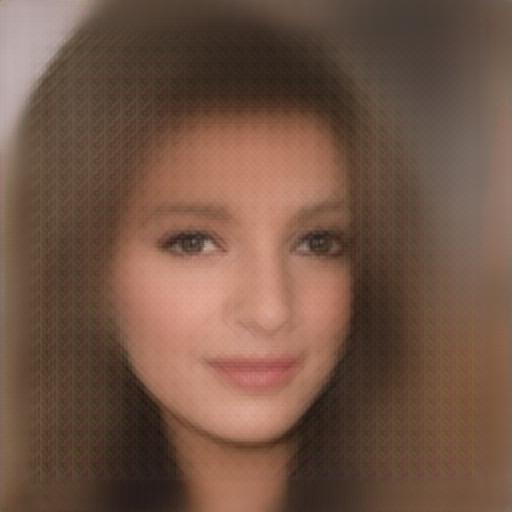
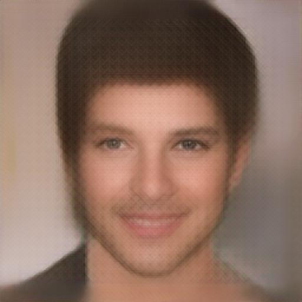
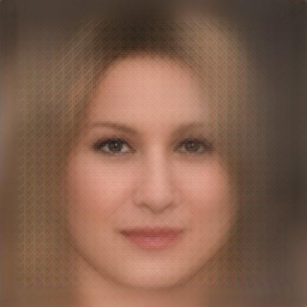
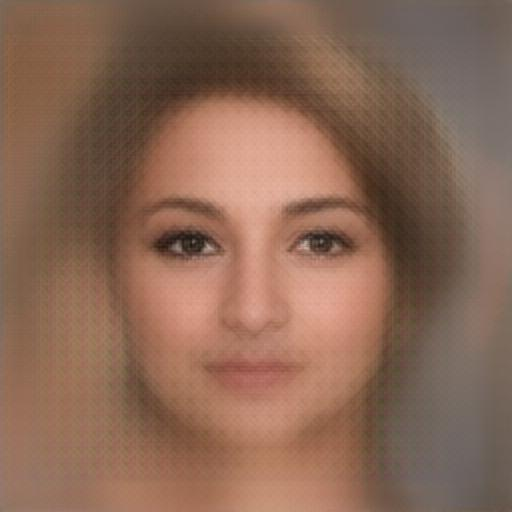
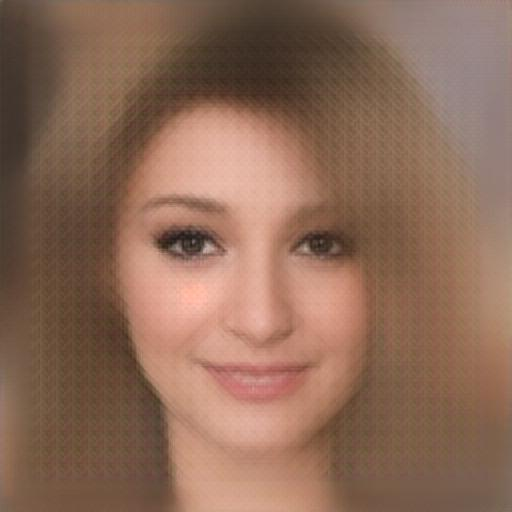

# DeepFaceDrawing

**This implementation is mostly based on [DeepFaceDrawing: Deep Generation of Face Images from Sketches](http://geometrylearning.com/paper/DeepFaceDrawing.pdf), but with several modifications, includes number of layers, losses, and datasets. Please refers to [this repository](https://github.com/IGLICT/DeepFaceDrawing-Jittor) for the original implementation.**

A generative model that could generate photo-realistic face images from hand-sketch face images.

<table>
  <tr>
    <td></td>
    <td></td>
    <td></td>
    <td></td>
    <td></td>
  </tr>
  <tr>
    <td></td>
    <td></td>
    <td></td>
    <td></td>
    <td></td>
  </tr>
</table>

## Dataset

Information about dataset is available at [Xu-Justin/person-face-sketches](https://github.com/Xu-Justin/person-face-sketches#readme).

## Training

Training process is divided into two stages. The first stage training will train the component embedding module to extract latents of each component from the sketches. Then, the second stage training will train the feature mapping module and image synthesis module to generate photo-realistic face images from the latents extracted by the component embedding module.

**Stage 1: Component Embedding**

```
python3 train_stage_1.py \
    --dataset person-face-sketches/train/ \
    --dataset_validation person-face-sketches/val/ \
    --batch_size 2 \
    --epochs 20 \
    --output weight/weight/DeepFaceDrawing/ \
    --device cuda
```

**Stage 2: Feature Mapping and Image Synthesis**

```
python3 train_stage_2.py \
    --dataset person-face-sketches/train/ \
    --dataset_validation person-face-sketches/val/ \
    --batch_size 2 \
    --epochs 20 \
    --resume_CE weight/weight/DeepFaceDrawing/CE/ \
    --output weight/weight/DeepFaceDrawing/ \
    --device cuda
```

**NOTES: This training process requires large GPU memory allocations, it is recommended to have at least 8GB of GPU memory to perform the training process. Please consider to decrease the number of batch size if your have insufficient GPU memory.**

## Model Weight

Information about trained model weight is available at [Xu-Justin/DeepFaceDrawing-Weight](https://github.com/Xu-Justin/DeepFaceDrawing-Weight#readme).

## CLI Inference

**Single Image Inference**

The following commands will inference `images.jpg` and then saved the result to `output.jpg`.

```
python3 inference.py \
    --weight weight/weight/DeepFaceDrawing/ \
    --image images.jpg \
    --output output.jpg \
    --device cuda
```

**Folder of Images Inference**

The following commands will inference all images in the folder `input_folder` and then saved the result to `output_folder`.

```
python3 inference.py \
    --weight weight/weight/DeepFaceDrawing/ \
    --folder input_folder/ \
    --output output_folder/ \
    --device cuda
```

**NOTES: The inference process will perform [sketch simplification](https://esslab.jp/~ess/publications/SimoSerraSIGGRAPH2016.pdf) and dimension resize to `512 x 512` pixels. The sketch simplification model requires [`model_gan.pth`](https://drive.google.com/file/d/1-16NelGGRQBOBa42OFpgu3QX4y4rSs0q/view?usp=sharing).**

## Web Application

The following commands will host the model as web-version application at `localhost:8000`.

```
python3 web.py \
  --weight weight/weight/DeepFaceDrawing/ \
  --device cuda \
  --host 0.0.0.0 \
  --port 8000
```

**Docker Version Web Application**
```
COMING SOON.
```

**NOTES: The inference process will perform [sketch simplification](https://esslab.jp/~ess/publications/SimoSerraSIGGRAPH2016.pdf) and dimension resize to `512 x 512` pixels. The sketch simplification model requires [`model_gan.pth`](https://drive.google.com/file/d/1-16NelGGRQBOBa42OFpgu3QX4y4rSs0q/view?usp=sharing).**

## References

* Chen, S. Y., Su, W., Gao, L., Xia, S., & Fu, H. (2020). DeepFaceDrawing: Deep generation of face images from sketches. ACM Transactions on Graphics (TOG), 39(4), 72-1.

* Lee, C. H., Liu, Z., Wu, L., & Luo, P. (2020). Maskgan: Towards diverse and interactive facial image manipulation. In Proceedings of the IEEE/CVF Conference on Computer Vision and Pattern Recognition (pp. 5549-5558).

* Liu, Z., Luo, P., Wang, X., & Tang, X. (2015). Deep learning face attributes in the wild. In Proceedings of the IEEE international conference on computer vision (pp. 3730-3738).

* Simo-Serra, E., Iizuka, S., Sasaki, K., & Ishikawa, H. (2016). Learning to simplify: fully convolutional networks for rough sketch cleanup. ACM Transactions on Graphics (TOG), 35(4), 1-11.

* Isola, P., Zhu, J. Y., Zhou, T., & Efros, A. A. (2017). Image-to-image translation with conditional adversarial networks. In Proceedings of the IEEE conference on computer vision and pattern recognition (pp. 1125-1134).

* Johnson, J., Alahi, A., & Fei-Fei, L. (2016, October). Perceptual losses for real-time style transfer and super-resolution. In European conference on computer vision (pp. 694-711). Springer, Cham.
